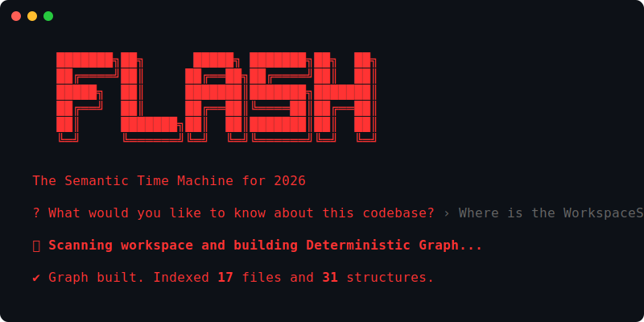

<div align="center">
  
# ⚡ FLASH
**The Semantic Time Machine for AI Agents.**



*Stop trying to teach your AI Agent how to guess codebase architecture. Give it **Deterministic Memory** instead.*

</div>

---

## The Problem: "Context Exhaustion"

If you've built AI Agents or used AI tools in 2026, you know the pain:
1. You ask your Agent to fix a bug: *"Why did the build fail?"*
2. The Agent searches standard RAG (Vector Search) and finds 15 files with the word "build". It guesses the wrong one.
3. You prompt the Agent: *"No, look at the error from the terminal."*
4. It hallucinates a fix that breaks three other files because it doesn't understand the underlying dependency graph.
5. Three hours later, you fix it yourself.

LLMs are brilliant reasoners, but they suffer from **Information Poisoning** when fed chaotic, non-deterministic text.

## The Solution: "Tri-State Memory Vault"

**FLASH** is a framework that fundamentally changes how Agents remember and interact with codebases. 

Instead of forcing the LLM to guess how functions are wired together or why an error occurred, **FLASH pre-packages all of that context into a 100% deterministic, self-validating Graph and Time-Series DB.**

When an Agent uses FLASH, it doesn't hallucinate architecture. It asks the Deterministic Knowledge Base (DKB).

---

## ⚡️ Zero-Friction Insights (The Wizard)

You don't need to be a Python or TypeScript expert to get 100% reliable codebase context.

1. **Run the Wizard:**
```bash
flash wizard
```
The stunning, interactive red-themed CLI will map your entire project in seconds. On your first run, it will securely ask for your preferred AI Provider (Gemini or OpenAI) to power its conversational reasoning.

2. **The Magic Output:**
FLASH instantly reads your codebase, building a perfect AST Tree-Sitter graph and outputs exactly where things are, how they connect, and what terminal errors recently caused them to fail.

3. **Deploy to your Agent:**
Run FLASH locally alongside your Agent. It acts as an active, un-hallucinating brain for any LLM.

---

## 🛠 Absolute Determinism (The Architecture)

FLASH exposes a powerful architecture for building enterprise-grade, hallucination-free Agents.

### 1. Deterministic Core (Graph DB)
Uses `tree-sitter` to parse code into Abstract Syntax Trees. It maintains a rigid, mathematical graph of all functions and classes. LLMs will *never* guess structure again.

### 2. Autonomous Chronological Engine (Time-Series)
FLASH automatically links your actions to your code:
*   **The Interceptor:** Run `flash run npm test` and FLASH silently captures terminal errors and memorizes them.
*   **Git Auto-Correlation:** Run `flash sync-git` to instantly map your recent commits to the errors that caused them.

### 3. Orchestrator Agent
Intelligently routes queries. If you ask "why", it queries the Timeline. If you ask "where", it queries the Graph. It then injects this verified truth into a strict System Prompt so the LLM provides a perfectly accurate, conversational response. **If it lacks context, it strictly refuses to answer rather than guessing.**

---

## 📦 Installation & Upgrading

```bash
# Requires Node >= 18
npm install -g flash-memory
```

**Zero-Friction Updates:**
When a new version of FLASH drops, you don't even need npm. Simply run:
```bash
flash update
```

---

<div align="center">
  <i>Built for the next generation of autonomous systems.</i>
</div>
