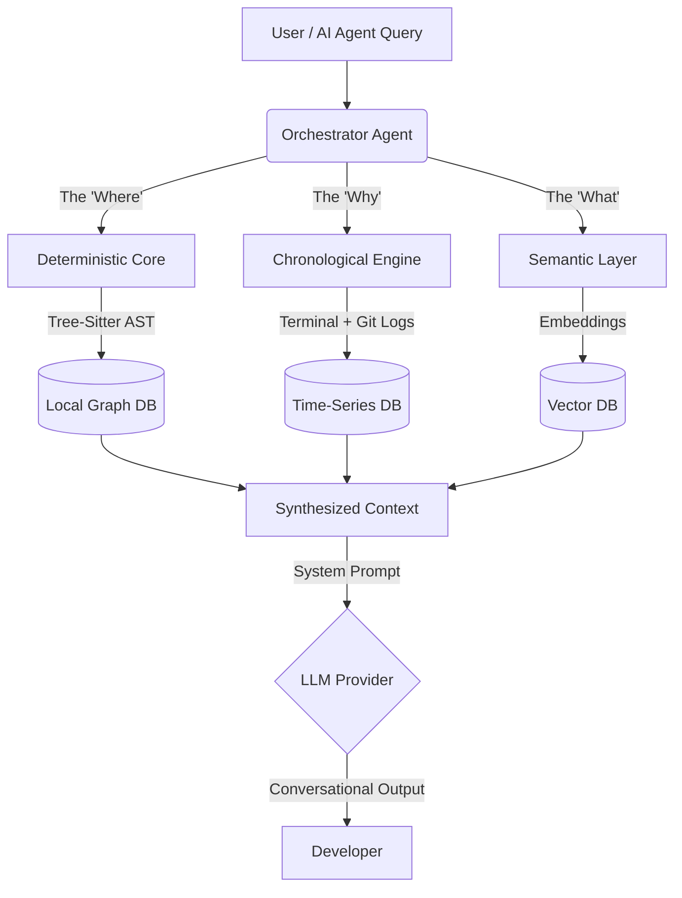

<div align="center">
  
  <br/>
  <h1>⚡ FLASH</h1>
  <p><b>The Deterministic Memory Engine for Autonomous AI Agents</b></p>
  <p>
    <i>Stop relying on probabilistic RAG. Give your Agent mathematical certainty about your codebase.</i>
  </p>
</div>

---

## 🧠 The Philosophy: Beyond RAG

In the era of AI-assisted engineering (2026), the bottleneck is no longer code generation—it's **Information Poisoning**. 

When an AI Agent relies on standard Vector Retrieval (RAG), it guesses how your codebase fits together based on semantic similarity. It hallucinates dependencies, misses inherited methods, and completely ignores the chronological *context* of why a piece of code was written (e.g., a recent terminal error).

**FLASH** replaces probabilistic guessing with a **Deterministic Knowledge Base (DKB)**. It builds a mathematically rigid graph of your codebase using Abstract Syntax Trees (AST) and links it directly to your live terminal errors and Git history.

---

## 🏗️ System Architecture

FLASH operates as a localized "Tri-State Memory Vault" that runs entirely on your machine.



### The Three Pillars

1. **The Deterministic Core (Graph):** Uses `tree-sitter` to parse your TypeScript/JavaScript files. It knows *exactly* where a class is defined and what functions it contains. No guessing.
2. **The Chronological Engine (Timeline):** Tracks the lifecycle of bugs. It intercepts terminal command failures and automatically correlates them to the Git commits that fix them.
3. **The Orchestrator Agent (Synthesizer):** Intelligently routes queries to the correct database, extracts the hard facts, and injects them into a strict prompt for your local or cloud LLM to explain.

---

## 🚀 Getting Started

### Installation

Requires Node.js >= 18. Install globally to access the `flash` command from any workspace.

```bash
npm install -g flash-memory
```

### First-Run Configuration

Navigate to your project directory and initialize FLASH:

```bash
cd my-project/
flash wizard
```

On the first run, the interactive CLI will ask you to select your preferred AI provider (Google Gemini or OpenAI) and securely store your API key in `~/.flash_config.json`.

---

## 💻 Core Workflows

FLASH provides a suite of commands designed for zero-friction integration into your daily workflow.

### 1. The Interactive Wizard
For a guided, visual experience, launch the main interface. FLASH will scan your directory, build the deterministic graph, and allow you to ask complex questions.

```bash
flash wizard
# "Where is the WorkspaceScanner defined?"
# "How does the Orchestrator handle errors?"
```

### 2. The Terminal Interceptor
Stop copy-pasting errors to ChatGPT. Run your standard dev commands through the FLASH interceptor. If the command fails, FLASH silently captures the `stdout`/`stderr` and commits it to memory.

```bash
flash run npm test
flash run npx tsc --noEmit
```

### 3. Git Auto-Correlation
Sync your repository's history into FLASH. It will automatically read recent commits and link them to the terminal errors that preceded them, creating a complete "Cause and Effect" timeline.

```bash
flash sync-git
```

### 4. Zero-Friction Upgrades
Stay up to date with the latest features without fighting package managers.

```bash
flash update
```

---

## 🛡️ Security & Privacy

*   **Local First:** Your codebase is parsed and indexed entirely on your local machine inside a `.flash/` directory. Source code is *never* sent to the cloud unless specifically included in the synthesized context sent to your configured LLM.
*   **Secure Interceptor:** The `flash run` command is built with hardened execution layers (`shell: false`) to prevent arbitrary command injection.
*   **Key Management:** API keys are stored outside your project directory in your user home folder to prevent accidental commits.

<br/>
<div align="center">
  <i>FLASH - Engineering absolute truth for Autonomous Systems.</i>
</div>
